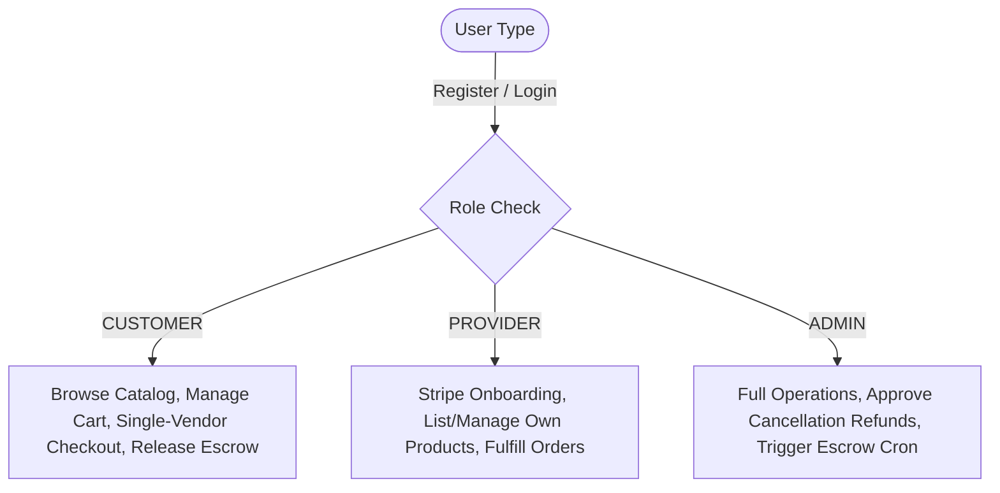
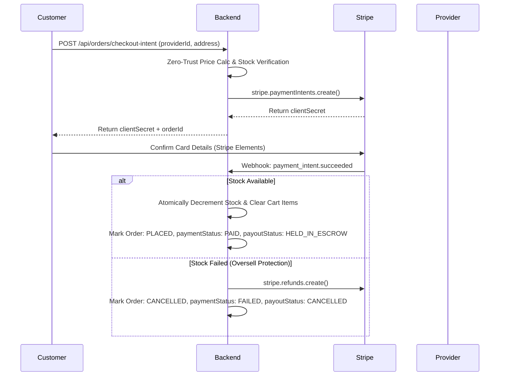
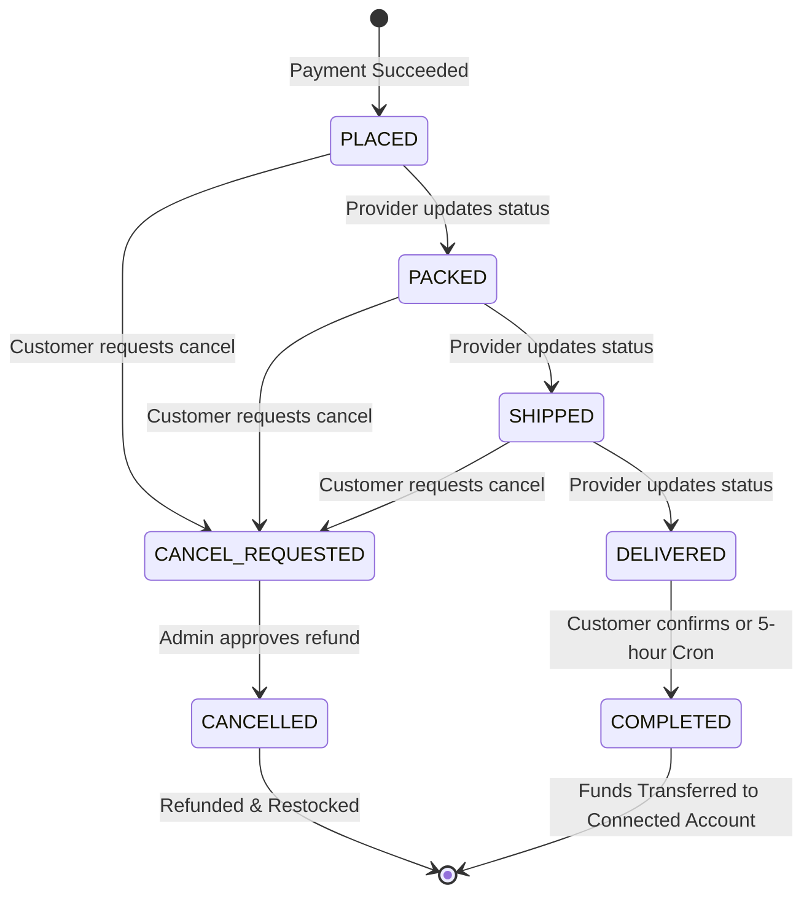

# Functional Requirements Document (FRD) - Multi-Vendor Escrow Marketplace

## 1. System Overview & Multi-Vendor Architecture

The Multi-Vendor Escrow Marketplace is a distributed e-commerce platform that allows **Customers** to buy products from multiple independent **Providers** (merchants). The platform mediates trust using a single-vendor checkout flow, holding payments in **Stripe-managed Escrow** until successful delivery is verified, or automatically releasing them via a background **Cron** job.

### 1.1 User Roles & RBAC Matrix
The system enforces strict Role-Based Access Control (RBAC) across three distinct user roles:

| Feature / Action | Customer | Provider (Merchant) | Admin |
| :--- | :---: | :---: | :---: |
| Browse catalog & search products | Yes | Yes | Yes |
| Manage personal shopping cart | Yes | No | No |
| Checkout & purchase packages | Yes | No | No |
| Confirm delivery / release escrow | Yes | No | No |
| Setup Stripe Connect onboarding | No | Yes | Yes |
| Manage products (Create/Edit/Delete) | No | Yes (Own only) | Yes (All) |
| Manage orders status (Packed/Shipped) | No | Yes (Own only) | Yes (All) |
| Process cancellations & refunds | No | No | Yes |
| Trigger payout release cron | No | No | Yes |



### 1.2 Provider Onboarding Gatekeeper
To ensure that buyers can always transact with valid sellers, the system enforces a strict gatekeeping pipeline for Providers.
* **Onboarding Mechanism:** Providers must connect a Stripe Connect Express account via `/api/stripe/onboarding-link`.
* **Connect Account State Sync:** The system listens to Stripe `account.updated` webhooks to dynamically toggle user flags (`isStripeReady`, `stripeDetailsSubmitted`) when charges and payouts are enabled.
* **Gatekeeping Rule:** Providers *cannot* create or edit product listings, and their products are hidden from the search catalog, unless `isStripeReady === true`.

---

## 2. Product Catalog & Management

### 2.1 Category Mapping
The platform supports exactly 10 strict product categories defined in the [`categories.ts`](file:///e:/civilmantra_task/marketplace-order-payment/frontend/src/constants/categories.ts) enum:
1. `ELECTRONICS` (Electronics & Gadgets)
2. `FASHION_APPAREL` (Fashion & Apparel)
3. `HOME_LIVING` (Home, Kitchen & Living)
4. `HEALTH_BEAUTY` (Beauty & Personal Care)
5. `GROCERY_GOURMET` (Grocery & Gourmet Food)
6. `SPORTS_OUTDOORS` (Sports, Fitness & Outdoors)
7. `BOOKS_STATIONERY` (Books & Stationery)
8. `TOYS_GAMES` (Toys, Games & Hobbies)
9. `AUTOMOTIVE_PARTS` (Automotive & Accessories)
10. `OFFICE_SUPPLIES` (Office & Tech Accessories)

### 2.2 Price and Stock Validation
* **Integer Currency Storage:** To prevent floating-point rounding errors common in monetary computations, the backend stores all product prices as integers in **cents/paise** (e.g., $19.99 is stored as `1999` cents).
* **Zod Validation Schema:**
  - Price: Preprocessed decimal numbers are converted to cents via `.transform((val) => Math.round(val * 100))`. The price must be positive and restricted to at most 2 decimal places.
  - Stock: Preprocessed strings or numbers are parsed and validated as non-negative integers (`.int().nonnegative()`).
* **Availability Flags:** Products support soft deletion (`isDeleted: true`) to preserve historical order records while excluding them from current catalog queries.

### 2.3 Cloudinary Image Pipeline
The platform utilizes a secure image upload pipeline with Cloudinary:
* **Upload Pipeline:** Multipart forms are parsed by `multer` and uploaded securely to Cloudinary storage.
* **Atomic Rollback Mechanic:** If product creation or updating fails validation checks *after* images have been successfully uploaded to Cloudinary, the system triggers an automatic rollback deletion of the uploaded assets using their `publicId` to prevent orphaned files.

---

## 3. Cart & Single-Vendor Grouped Checkout Flow

### 3.1 Single-Vendor Cart Grouping
While a Customer may add items from different merchants into their shopping cart, the system dynamically partitions the cart into separate **Vendor Packages** (grouped by `providerId`) using `serializeCart()`.

```json
{
  "_id": "cart_id",
  "user": "customer_id",
  "vendorPackages": [
    {
      "provider": { "_id": "provider_1_id", "businessName": "Vendor One" },
      "items": [ ... ],
      "totals": { "subtotal": 50.00, "shippingFee": 5.00, "tax": 1.50, "totalAmount": 56.50 }
    },
    {
      "provider": { "_id": "provider_2_id", "businessName": "Vendor Two" },
      "items": [ ... ],
      "totals": { "subtotal": 20.00, "shippingFee": 5.00, "tax": 0.60, "totalAmount": 25.60 }
    }
  ]
}
```

### 3.2 Isolated Checkout & Recalculation
* **Isolated Checkout:** Checkouts are strictly isolated per vendor. A Customer pays for one vendor package at a time by specifying the `providerId` during intent creation (`POST /api/orders/checkout-intent`).
* **Zero-Trust Pricing Recalculation:** The backend ignores any prices or totals supplied by the frontend. The server retrieves the latest prices directly from the database, sums the items, and appends a flat `$5.00` shipping fee and `3%` tax per vendor package to compute the total.
* **Inventory Boundary Check:** The checkout logic checks the current stock of all products in the selected package. If any item is out of stock or has insufficient quantity, the checkout process aborts immediately.

---

## 4. Stripe Payment, Escrow & Fulfillment Lifecycle

### 4.1 Payment Intent Creation
When a Customer executes a checkout:
1. An Order is created with `status: 'PLACED'`, `paymentStatus: 'PENDING'`, and `payoutStatus: 'HELD_IN_ESCROW'`.
2. A Stripe PaymentIntent is created with the metadata containing the `orderId` and `providerId`.
3. The platform uses Stripe Connect with **escrow** capabilities: the charge captures funds directly to the Platform's balance (`capture_method: 'automatic'`).

### 4.2 Webhook Processing (`payment_intent.succeeded`)
When Stripe fires the `payment_intent.succeeded` event to `/api/payments/webhook`:
1. **Idempotency Check:** Checks if the Stripe event ID has already been processed to prevent duplicate operations.
2. **Atomic Inventory Deduction:** The system attempts to decrement stock atomically for each product using:
   `Product.findOneAndUpdate({ _id: productId, stock: { $gte: quantity } }, { $inc: { stock: -quantity } })`
3. **Overselling Fallback (Refund):** If any item's stock cannot be allocated due to concurrent purchases (race conditions), the system rolls back any successfully decremented items in the order, updates the order status to `CANCELLED`, and automatically executes `stripe.refunds.create({ payment_intent: paymentIntentId })`.
4. **Success State Transition:** If stock deduction succeeds:
   - Order `paymentStatus` is updated to `PAID`.
   - The purchased items are pulled and removed from the customer's cart.
   - Payout remains `HELD_IN_ESCROW` on the platform balance.



### 4.3 Escrow Payout Release Pipeline
Funds captured from the customer are held securely on the platform account until released. The payout release can be triggered in two ways:
* **Manual Customer Confirmation:** Once the Provider ships the package and sets the order status to `DELIVERED`, the customer can click "Confirm Receipt" (`POST /api/orders/:id/release`). This triggers:
  - `stripe.transfers.create` using `source_transaction: order.stripeChargeId` to transfer the merchant's net payout amount to their Connected Express account.
  - Order status transitions to `COMPLETED` and `payoutStatus` to `TRANSFERRED`.
* **Automated Cron Fallback:** A recurring cron service (`POST /api/cron/release-payouts`) scans the database for any orders with `status === 'DELIVERED'` and `payoutStatus === 'HELD_IN_ESCROW'` that have been in the delivered state for **at least 5 hours**. The cron job executes the Stripe transfer automatically to release the escrow.

---

## 5. Cancellations, Restocking & Refunds



### 5.1 Cancellation Requests
* Customers may request order cancellations for orders that have not yet been marked as delivered (`status` is `PLACED`, `PACKED`, or `SHIPPED`) using `/api/orders/:id/cancel-request`.
* The order status transitions to `CANCEL_REQUESTED`.

### 5.2 Admin Review & Refund Trigger (yet to be implemented)
* Administrators review cancellation requests via `/api/admin/orders/cancellation-requests`.
* When an Admin approves a refund (`POST /api/admin/orders/:id/approve-refund`):
  1. The system calls `stripe.refunds.create` to return the entire charged amount (including shipping and taxes) to the customer's card.
  2. The system atomically restocks the products back into active inventory using `$inc: { stock: quantity }` for all items in the order.
  3. The Order transitions to `status: 'CANCELLED'`, `paymentStatus: 'REFUNDED'`, and `payoutStatus: 'CANCELLED'`.
